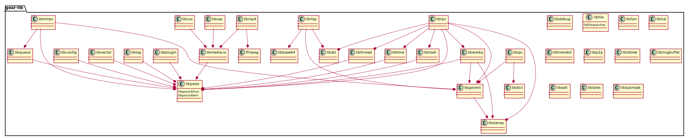

## Supported (on-going)
| Host OS    |      |                       |        |          |
|------------|------|-----------------------|--------|----------|
|PC linux    |cmake |x86_64-w64-mingw32-gcc |gcc     |ndk-build |
|windows     |cmake |mingw  (not passed)    |MSVC c1 |          |
|mac         |cmake |gcc                    |        |          |
|raspberrypi |cmake |arm-gcc                |        |          |
|esp32       |cmake |xtensa-esp32-elf       |        |          |

### cmake
   * MSVC on Windows:  
     `> mkdir build_msvc`  
     `> cd build_msvc`  
     `> '/c/Program Files/CMake/bin/cmake.exe' ../`  
     `> '/c/Program Files/CMake/bin/cmake.exe' --build .`  
   * MSYS2 on Windows (not portable for all gear-lib):  
     `$ mkdir build_msys2`  
     `$ cd build_msys2`  
     `$ cmake ../`  
     `$ make && make install`  
   * Linux:  
     `$ mkdir build_linux`  
     `$ cd build_linux`  
     `$ cmake ../`  
     `$ make && make install`  

### esp32
   * toolchain: xtensa-esp32-elf  
     `git clone https://github.com/espressif/esp-idf.git`  
    add esp-idf/tools to $PATH  
    `$ cd build/esp32-env`  
    `$ make menuconfig`  
    `$ make flash`  

### Windows
  * Windows7 install "Microsoft Visual Studio 10.0"  
    open cmd.exe  
   `> "D:\Program Files (x86)\Microsoft Visual Studio 10.0\VC\bin\vcvars32.bat"`  
   `> cd gear-lib\libposix\`  
   `> nmake /f Makefile.nmake clean`  
   `> nmake /f Makefile.nmake`  
   default debug version, compiler release version  
   `> nmake /f Makefile.nmake clean`  
   `> nmake /f Makefile.nmake MODE=release`
   
### Linux
  * install third-party libraries  
   `$ sudo apt install liblua5.2-dev libjansson-dev libpulse-dev libx264-dev libavcodec-dev libavformat-dev libavutil-dev libuvc-dev protobuf-compiler`

  * linux platform (>= Ubuntu14.04 >= gcc-4.8.4 32/64 bit)  
   `$ ./build.sh`  
   `$ sudo ./build.sh install`  
   default debug version，compiler release version  
   `$ ./build.sh {all|libxxx} linux release`   
   `$ sudo ./build.sh install linux release`  
   
  * host(linux) target(rasberrypi)  
    (you need download [toolchain of rasberrypi](https://github.com/raspberrypi/tools.git))  
   `$ ./build.sh all pi`  
   default debug version，compiler release version  
   `$ ./build.sh {all|libxxx} pi release`  

  * host(rasberrypi board)  
   `$ ./build.sh`  
   `$ sudo ./build.sh install`  
   default debug version，compiler release version  
   `$ ./build.sh {all|libxxx} linux release`  
   `$ sudo ./build.sh install linux release`  

  * android arm cross compile  
   (you need download [android-ndk-r9-linux-x86_64.tar.bz2](http://dl.google.com/android/ndk/android-ndk-r9-linux-x86_64.tar.bz2))  
   `$ ./build.sh all android`  
   default debug version，compiler release version  
   `$ ./build.sh {all|libxxx} android release`  
   
  * android naitve develop  
    also need ndk tools  
   `$ cd android_jni_libs`  
   `$ ndk-build`  
   default debug version，compiler release version  
   `$ ndk-build MODE=release`  
   After install, the libxxx.xx will be installed in /usr/local/lib/.  
   libxxx.h, libxxx.so or libxxx.a of libraries are also in ./output/$(ARCH)  

## How To Autogen C template code
   If you want to add your own library into the build script, no need repeat the same code, only auto gen libxxx framework.  
  `$ ./build/autogen_lib.sh libfoo`

## About Build
  * by default, build x86 on linux, and libxxx folder can be built independently
  * if only "libxxx folder" is checkout without "build folder", you can only build x86 and no color set
  * with "build folder", you can build x86, pi, android, ios and color is also set
  * "sudo make install" is needed when build libxxx alone.

## dependency
  * plantuml -tsvg dependency.txt  
    
