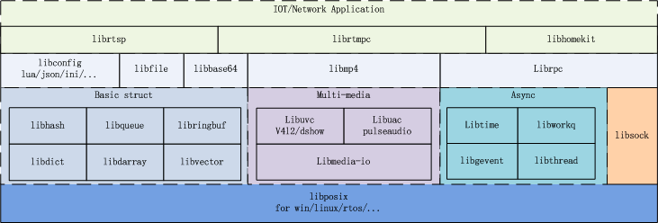

# Gear-Lib

English | [简体中文](README.cn.md)

This is a collection of basic libraries.
* All are written in POSIX C, aim to used compatibility on linux, windows, android, ios.
* Aim to reuse for IOT, embedded and network service development

## Data Struct
|  |  |
|--|--|
| libdict: Hash key-value dictonary library | libhash: Hash key-value library based on hlist from kernel |
| libringbuffer: | libqueue: queue library, support memory hook |
| librbtree: comes from linux kernel rbtree. | libsort: |
| libvector: | libdarray: Dynamic array |

## Network
|  |  |
|--|--|
| librtsp: Real Time Streaming Protocol server for ipcamera or NVR | librtmpc: Real Time Messaging Protocol client for liveshow |
| libsock: socket warpper api for easily use | librpc: Remote Procedure Call library |
| libipc: Inter-Process Communication, support mqueue/netlink/shm | libp2p: High level p2p punch hole library, easy API to use |
| libmqttc: MQTT client protocol | libhomekit: Apple homekit protocol |

## Async
|  |  |
|--|--|
| libgevent: Reactor event, like libevent | libthread: Thread wrapper |
| libworkq: Work queue in userspace | |

## I/O
|  |  |
|--|--|
| libstrex: string extension | libconfig: Support ini/json |
| liblog: Support console/file/rsyslog | libfile: File operations |
| libsubmask: ip addr transform | |

## Multi-Media
|  |  |
|--|--|
| libavcap: audio/video capture api (v4l2/uvc/esp32/dshow) | libmp4: MP4 muxer and parser |
| libjpeg-ex: | libmedia-io: audio/video frame/packet define |

## OS Abstraction Layer
|  |  |
|--|--|
| libposix: posix adapter for Windows/rtos/ios |

## Misc
|  |  |
|--|--|
| libdebug: Help to trace crash like gdb | libhal: hardware Abstraction Layer |
| libplugin: Dynamic link plugin | libtime: Time wrapper |
| libfsm: Finite State Machine | |

## How To Build
Please refer to [INSTALL.md](https://github.com/gozfree/gear-lib/blob/master/INSTALL.md) file for detailed information.

## License
Please refer to the [LICENSE](https://github.com/gozfree/gear-lib/blob/master/LICENSE.MIT) file for detailed information.

## Contacts
* Email: gozfree@163.com
* QQ Group: 695515645
* Github: [gear-lib](https://github.com/gozfree/gear-lib)
* Gitee: [gear-lib](https://gitee.com/gozfreee/gear-lib)
