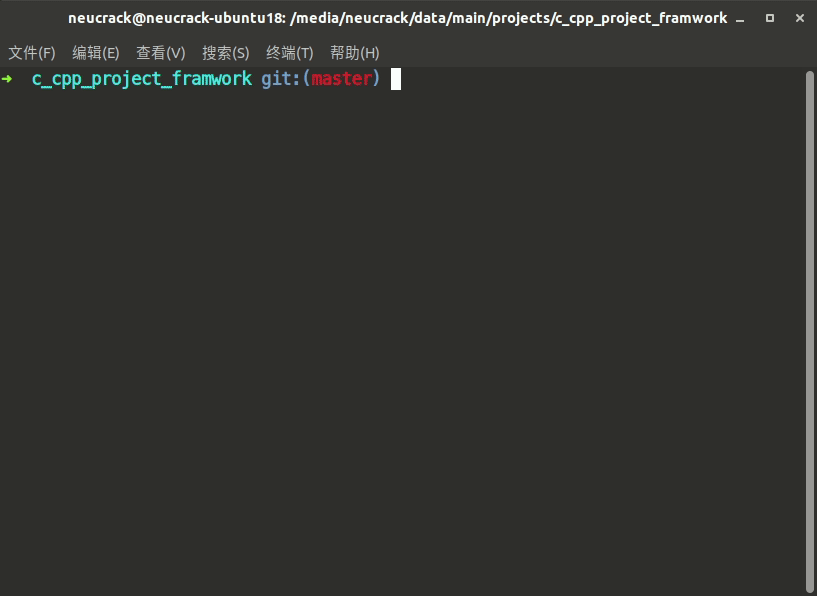
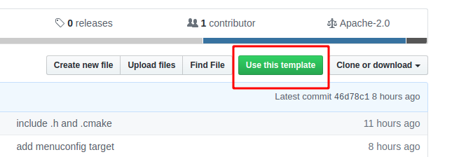

C CPP Project Framework (Template)
===================

[中文](./README_ZH.md)

**Simple** and **configurable** `C/C++` project/SDK template 
> `CMake` build system and support Kconfig with `GUI` configuration

Based on this project, you can quickly build your project construction system and reduce many unnecessary troubles~

If it helps you, please give a little star in the upper right corner~~ If needs improvement, just create an [issue](https://github.com/Neutree/c_cpp_project_framework/issues/new).  `(´ε｀ ʃƪ)♡`


The target developer of this project:

* Developers who are preparing to write `SDK` and need to write their own build system
* Preparing to start writing a project who needs to write a build system
* Who don't know much about `CMake`, but want to learn `CMake`
* Who want to refactor the code engineering build system, maybe because of th bad old messy build system
* Who want to add a very useful configuration system to the build system, you can quickly add and delete code modules as needed, and it is best to have an GUI configuration.
* Who want the project to generate a variety of `IDE` supported projects.





## Features

* The syntax is simple, no knowledge of `Makefile` or `CMake` is required, and it is very simple to use only by modifying the value of the variable based on the template
* Project structure based on the concept of component, which is convenient for building a project structure with a clear hierarchical structure
* Calling between components only requires one statement to specify the dependencies (such as `list(APPEND ADD_REQUIREMENTS component1)`), without setting extra variables such as `INCLUDE path` to call the content of the dependent component in the source code
* Use `Kconfig` to enable project components and code to be tailored and configured to facilitate the project to meet different needs
* Conveniently introduce static libraries (`.a`) and dynamic libraries (`.so`) (such as `list(APPEND ADD_STATIC_LIB "lib/libtest.a")`)
* Conveniently generate static libraries (`.a`) and dynamic libraries (`.so`) (by default, static libraries are generated. If you need components to generate dynamic libraries, you can use `register_component(DYNAMIC)` to register the module)
* Using the `Python` script as an aid, you can easily add commands and tools, and you only need to execute simple commands to compile (such as `python project.py build` `python project.py menuconfig`)
* Conveniently used as `SDK`, the project example can be placed directly in the `SDK` directory, or it can be placed anywhere on the disk separately, just set the environment variable `MY_SDK_PATH`
* Cross-compilation friendly, well as an embedded device `SDK`

## Get Started

* Clone code by:
```
git clone https://github.com/Neutree/c_cpp_project_framework --recursive
```
> Arg `--recursive` is needed to clone all submodule, or code is not complete

* Or create your github repository based on this template:</br>You can create your github repository with this tempalte by click `use this template` button</br>

* Start compile</br>there's two way, use `project.py` script or use original CMake command
  * With project.py(recommend)
    ```
    cd examples/demo1
    # python project.py --toolchain /opt/toolchain/bin --toolchain-prefix mips-elf- config
    python project.py menuconfig
    python project.py build
    # python project.py build --verbose
    ./build/demo1
    python project.py clean
    python project.py distclean
    # python project.py clean_conf
    ```
    * Change dir to project directory
    * Set toolchain path(don't need set if use `gcc`)
    * Config project by command `python project.py menuconfig`, it will generate `global_config` files at `build/config` directory, so we can use it in component's `CMakelists.txt` directly， or in `C/CPP` source files by `#include "global_config.h"`
    * Build project by command `python project.py build`, or output verbose build info with command `python project.py build --verbose`
    * Clean build by `python project.py clean`, clean config generated by `menuconfig` by `python project.py distclean`, this command will not clean toolchain config
    * Clean toolchain config by `python project.py clean_conf`
  * With original CMake command
    ```
    cd examples/demo1
    # python project.py --toolchain /opt/toolchain/bin --toolchain-prefix mips-elf- config
    mkdir build && cd build
    cmake ..
    make menuconfig
    make -j10
    ./build/demo1
    make clean
    rm -rf ./*
    ```
    * Change dir to project directory
    * Set toolchain path(don't need set if use `gcc`)
    * Make a temporary directory and switch the current path to this directory(`build`)
    * Generate makefile by command `cmake ..`, `..` means the project directory
    * Config project by command `make menuconfig`, it will generate `global_config` files at `build/config` directory, so we can use it in component's `CMakelists.txt` directly， or in `C/CPP` source files by `#include "global_config.h"`
    * Build project by command `make`, or parallel build with [make -jN](http://www.gnu.org/software/make/manual/make.html#Parallel)， and output verbose build info with command `make VERBOSE=1`


## Structure

| directory/file | function |
| -------------- | -------- |
| root directory | root directory of this project, also `SDK` projects' `SDK` directory |
| assets         | store assets like image etc. you can delete it if not use it |
| components     | as a component/lib |
| examples       | project dir or demo dir； `SDK` projects' example/project dir, this directory can be separated from the `SDK` directory, just set environment`MY_SDK_PATH` to `SDK` directory's path. |
| tools          | tools like `cmake`、`kconfig`、`burn tool` etc. |
| Kconfig        | root `Kconfig` configuration |


### 1) Component

All libraries are placed as components in the `components` directory or under the project directory. Each component uses a directory. This directory is the name of the component. In order to make the project look more concise, the components are not nested. All components are a hierarchy, and the relationships between components depend on dependencies to maintain

All source files must be in a component. Each project must contain a component called `main` (ie `examples/demo1/main` directory). Each component contains the following files:

* `CMakeLists.txt`: Must exist, declare the component source file and the dependent component, and call the registration function to register itself. For details, please refer to `CMakeLists.txt` of `components/component1` and `components/component2`.

* `Kconfig`: Optional, contains configuration options for this component. In this component or other `CMakeLists.txt` that depends on the component of this component, you can use these configuration items after adding a `CONFIG_` prefix. e.g. In `components/component2`, there is a `COMPONENT2_ENABLED` option in `Kconfig`. We use this variable `if(CONFIG_COMPONENT2_ENABLED)` in its `CMakeLists.txt` to determine if the user configuration want to register this component or not.

### 2) Project Directory

The project directory is in the `examples` directory. Of course, the name of this directory can be modified according to actual needs. The following can contain multiple actual project directories. You can compile when you need to compile the project and switch to the corresponding directory. As mentioned above, there must be a `main` component in each project directory. Of course, you can also put a lot of custom components. More refer to the `examples/demo1` project directory.

Files under the project directory:

* `CMakeLists.txt`: must exist, project properties file, you must first include `include(${SDK_PATH}/tools/cmake/compile.cmake)`, then use the `project` function to declare project name, such as `project(demo1)`, Of course, you can also write other conditions or variables, etc., using the `CMake` syntax, refer to the `examples/demo1/CMakeLists.txt`

* `config_defaults.mk`: Optional, project default configuration file, the default configuration will be loaded when `cmake` execute. The format of the configuration is `Makefile`. You can use the terminal GUI configuration (`make menuconfig`) to generate the configuration file, the generated configuration file is in `build/config/global_config.mk`, then copy to `config_defaults.mk`.
> Note: After modifying `config_defaults.mk`, you need to delete the files in the `build` directory (or just delete the `mk` file in the `build/config` directory) to regenerate, because the current build system will use the existing configuration file (`build/config/global_config.mk`)

* `project.py`: tool script call entry, use `python project.py menuconfig` `python project.py build` and other commands to start building

How to put the project directory anywhere on the disk:

* Change the `MY_SDK_PATH` in `CMakeLists.txt` and `project.py` to the name of the environment variable you like, and then set the value of this environment variable in the terminal to the path of the `SDK`, you can change the project directory It can be compiled anywhere


## Store SDK and project directory separately

Normally, you only need to modify the name of the `example` directory according to your needs, such as changing it to `projects`, or creating a new directory in the project root directory, such as `projects/hello_world`, and copy files in the `examples/demo1`'s content to start a project

In addition, the project directory and the SDK directory can also be stored separately. This is especially used for open source projects, a copy of SDK, users develop based on this SDK, which is more conducive to the spread of routines, users do not need to copy a copy of the SDK, just specify the use SDK version (git commit number)
To do this, only need:

* Download `SDK` and put it in a directory, such as `/home/neucrack/my_SDK`

```
git clone https://github.com/Neutree/c_cpp_project_framework --recursive
```
Note that the `--recursive` parameter is used here, because sub-modules are used in the project. The advantage of sub-modules is that each project is managed separately. For example, `Kconfiglib` is used as a sub-module to provide `menuconfig` with interface function configuration

**If you did't update submodule, the compile will error!!!!**

If you forget to add this parameter when cloning, you can also use the following command to update the submodule:
```
git submodule update --init --recursive
```
In addition, when the remote repository is updated, the user also needs to use the following command to update the code (ie update the submodule code at the same time):
```shell
git pull --recursive
```
or:
```
git pull
git submodule update --init --recursive
```

Of course, you can also just delete the `.git` directory, and start a git repository with no submodule~~~


* Then export the variable `export MY_SDK_PATH=/home/neucrack/my_SDK` in the terminal, which can be placed in the `~/.bashrc` or `~/.zshrc` file, so that this variable will be automatically added every time the terminal is started
* Then create a project anywhere, such as copy the entire content of the folder of `example/demo1` to `/home/neucrack/temp/my_projects/demo1`
* Then clear the previous build cache (if there is one, ignore it if there is none)
```
python3 project.py distclean
```
* Then configure and build
```
python3 project.py menuconfig
python3 project.py build
```

## License

**MIT**， see [LICENSE](./LICENSE)


## Open source projects used by this project

* [Kconfiglib](https://github.com/ulfalizer/Kconfiglib)： `Kconfig`'s `Python` implementation

## Repos used this framwork

* [Maix-Speech](https://github.com/sipeed/Maix-Speech): AI speech recognization lib for embedded devices
* [MaixPy](https://github.com/sipeed/MaixPy/): `Micropython` port for `AIOT` chip `K210`
* [libmaix](https://github.com/sipeed/libmaix): A lib for embeded AI model running with hardware accelaration
* [MF1_SDK](https://github.com/sipeed/MF1_SDK): SDK for `MF1` AI module(board)

## Other Similar Reference

* [ESP_IDF](https://github.com/espressif/esp-idf)：  `SDK` of `ESP32`, Written very well
* [RT-Thread](https://github.com/RT-Thread/rt-thread)：not `CMake`, but also use component

